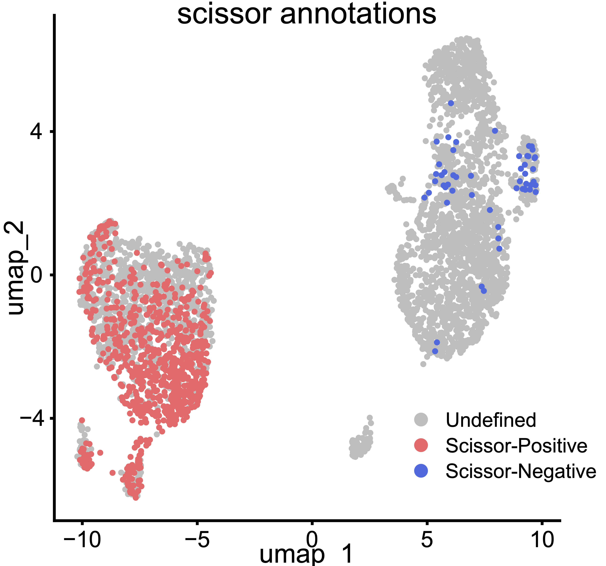

# ASC_cytokine_proteomics_sc
Single cell RNA sequencing and bulk proteomics analysis of ASCs in response to inflammation, accompanying Parsons et al. 2025

This repository contains a script and files used to analyze single cell and bulk proteomics data of unmodified adipose stromal vascular fraction and cultured adipose-derived stem/stromal cells to better characterize in the ASC response to inflammatory stimuli in vitro. The integration of bulk proteomics and single cell RNA sequencing also allows us to gain novel insights in how in vitro treatments translate to in vivo biology. We validate these findings using a publicly available dataset, and expand on the implications for different ASC phenotypes in SVF uussing CellChat.

Proteomics data can be found on MassIVE (MSV000094493)
single cell data can be found on GEO (GSE270461)
Publicly available validation set: PMID: 35296864, Study #SCP1376 in single-cell portal

## Set up for script
Human ASCs cultured with and without inflammatory cytokines and unmodified human SVF cells were assayed for single cell RNA sequencing using the 10x Genomics platform. The resulting sequencing data was aligned and pre-processed using CellRanger software, and the resulting barcode, matrix, and feature files were saved for reading in to the script. Concurrently, Human ASCs were cultured in the same inflammatory cytokines and then were assayed for proteomics in bulk using LC-MS/MS. Proteins and their relative abundances were identified and the data were exported into an excel spreadsheet.

## Running the script
### Single cell RNA sequencing analysis
The matrix, barcode, and feature files for the SVF sample, a control cultured ASC sample, and an ASC sample cultured in inflammatory cytokines are read into R and individual Seurat objects are generated. Following object subsetting using typical QC metrics (percent mitochondrial RNA, nCounts, and nFeatures), clustering is optimized. We integrate the control and cytokine-stimulated samples using Harmony. Effects of cell cycle genes are regressed out from the merged object containing both cultured samples. 

The standard Seurat v5 pipeline is used to generate UMAPs for the P0 data and the cultured data. Azimuth cell annotation using the adipose reference atlas is performed on the SVF. We further annotate major cell groups through investigation of marker genes, many of which are identified in Liu et al., Nature 2022, and others found in literature as described in the manuscript text. Following cell type annotation, dot plots are generated to show expression of marker genes for each cell type in SVF cells. A dot plot is then made to describe marker gene expression for the clusters in the SVF object. Violin plots showing cluster-specific marker genes are also generated.

EnrichR is used to annotate functional cell states of the cultured ASCs.

For the cultured cells, we also investigate the trajectory of response to inflammatory stimulus using Monocle3. We calculate pseudotime, then correlate the average pseudotime for each cluster and correlate those average values to enrichment scores for the 50 Hallmark Pathways. This provides insight into the biological processes that ASCs up-regulate in response to inflaammatory cytokines.

### Protemic profiling
Next, analysis using just the bulk proteomics of 10 human donor ASC samples (5 donors, control and cytokine-stimulated) is performed. PCA plotting shows separation based on presence or absence of cytokine treatment. Following this single cell RNA sequencing pipeline, the proteomics data is read in and protein names are substituted for gene names. Differential protein analysis is plotted as a volcano plot. The heatmaps showing all proteins, differentially abundant proteins, and proteins encoded by DE genes following cytokine stimulation (Hu et al, Cell BioSci 2024) are made.

### Single cell RNA sequencing and bulk proteomic concurrence testing
To better investigate the difference in ASC -omic profiles following cytokine stimulation, we examine the concurrence of results between the two modalities. We first examine differentially expressed genes in pseudobulked scRNAseq between control and cytokine-stimulated ASCs, the differentially-abundant proteins in the bulk proteomics data, and the overlap in identified genes/proteincs from these two analyses. We examine the correlation of expression levels and protein abundances between the two modalities, and use GSEA to determine if there are biological processes that are enriched against between the two modalities by examining the genes/prroteins with low concordance. We then perform GSEA on the single cell data alone, the proteomics data alone, and the 181 overlapping molecules identified as differentially expressed in both modalities.

### Scissor integration of single-cell RNA sequencing SVF data and bulk proteomics ASC data
Scissor integration (Sun et al, Nat. Biotechnol. 2022) is used to identify a subset of SVF cells that are phenotypically similar to ASCs that are cultured with inflammatory cytokines in vitro. ASCs deemed Scissor-Postive and Scissor-Negative are compared using differential gene expression analysis and from that list, a phenotype of 6 differentially expressed genes encoding surface proteins is identified. We then annotate the Scissor-positive and Scissor-negative ASCs and run CellChat to examine similarities and differences in communication pathways and probabilities within the adipose niche of these ASCs of different phenotypes. We validate our Scissor surface marker profile in a publicly available scRNAseq dataset of human white adipose tissue, and verify that Scissor+ cells are enriched with cytokine stimulus in our cultured ASCs.

